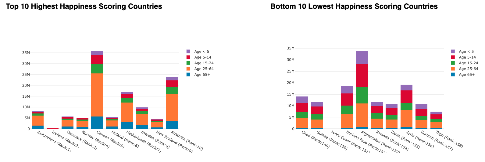

# World Happiness Dashboard

[Link to dashboard](http://127.0.0.1:5500/World%20Happines%20Index%20Project/project%203%20/Module-16-Group4-Project3/index.html)
 

## Project Description

This interactive dashboard explores the relationships between World Happiness Index rankings and key country-specific factors, including population, education spending as a percentage of GDP, and global migration trends. Motivated by an interest in how these metrics might influence happiness scores, the dashboard uses visualizations and data insights to highlight potential correlations and cause-effect relationships that contribute to a nation’s overall happiness.

## Tools and Libraries

- **Data ETL**: Python, SQL, Excel
- **Libraries**: Pandas, NumPy, Plotly, jVectorMap
- **Visualization**: HTML, CSS, JavaScript

## Data Analysis Process

### Data ETL

The raw data was first cleaned and consolidated into a single, comprehensive file using Python in Jupyter Notebook to ensure all relevant information was present and usable for analysis. While most countries maintained consistent naming across datasets, some required standardization due to varying nomenclature, as shown in the example image.

    South Korea Needed to be standardized from the following:
       - Republic of Korea
       - Korea, Republic of
       - South Korea, Republic of Korea

Using Pandas, we extracted essential columns, then merged the data into a unified table. This final dataset was stored in SQL for querying and analysis, and also exported as a CSV file for use in JavaScript, as illustrated in the schema diagram.

### Dashboard and Visualization Overview

Utilizing the jVectorMap plugin, this project features interactive heat maps that visualizes World Happiness Scores and migration populations, with filter options for each year from 2015 to 2021. Hovering over a country reveals its specific World Happiness Score, allowing users to explore global trends in happiness and migration population.

Stacked bar graphs, created using Plotly, showcase the top and bottom 10 countries by happiness score, offering a comparative analysis across key factors such as age distribution, education spending, and migration movement. This approach provides an insightful visual comparison of how these factors align with the highest and lowest happiness scores globally.

## Data Source

**Kaggle**: [World Happiness Index (2015 - 2021).](https://www.kaggle.com/datasets/unsdsn/world-happiness) 
**Our World In Data**: [Population Data (2015 - 2021).](https://ourworldindata.org/grapher/population) 
**Our World In Data**: [Education Expenditure data (2015 - 2020).](https://ourworldindata.org/grapher/share-of-education-in-government-expenditure)  
**UNdata**: [Migration Data (2015 & 2020).](https://www.un.org/development/desa/pd/global-migration-database)  
